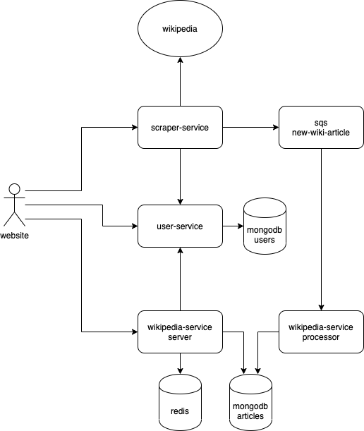

# Aspecto-Demo-Services

## Architecture

This demo application is a micro-serivce system which scrapes articles from wikipedia, ingests them, stores them in a database and exposes them for users to interact.

It is composed of the following infra services:

- Users Service:
  - Authenticate registered users
  - Register new users to the system
- Scraper:
  - Expose api to create new scraping jobs
  - Access the wikipedia public api to search for articles with specific text, and push the result to a simple pipeline sqs queue for processing.
- Wikipedia Service:
  - In PROCESSING mode - fetch wikipedia article data from the pipeline, and store it in the db.
  - In SERVER mode - expose http api for users to query and modified the articles data
- Mongo Database:
  - Store users information for authentication
  - Store specific wikipedia articles
- Redis Database:
  - Cache for fast retrieval of article data which was fetched lately
- AWS LocalStack:
  - sqs queue for transferring data between scraper and wikipedia service processor.



## How to Run

prerequisite: docker and docker-compose installed on the machine.

1. `git clone` the project locally

```
https://github.com/aspecto-io/aspecto-demo-services.git
```

2. Run the following commands in terminal:

```
docker-compose pull && ASPECTO_GITHASH=$(git rev-parse HEAD) docker-compose up
```

The pull command might take a few minutes on first run.
Docker compose will pull any missing images, run the services, and output logs to the console.

3. Open [Aspecto application](https://app.aspecto.io/) and login with the following credentials:

```
Email: wikipedia-demo@aspecto.io
Password: Aspecto123
```

```
5. Browse http://localhost:3002/ and play with the system. Login with the following credentials:
```

Email: wikipedia-demo@aspecto.io
Password: Aspecto123

```

Examine the live traces generated in aspecto website. You can also open Postman, load the collection `aspecto-demo-services.postman_collection.json` from this repository's main directory, and send requests.


// TODO
remove 4
then app, see filters etc..
```
